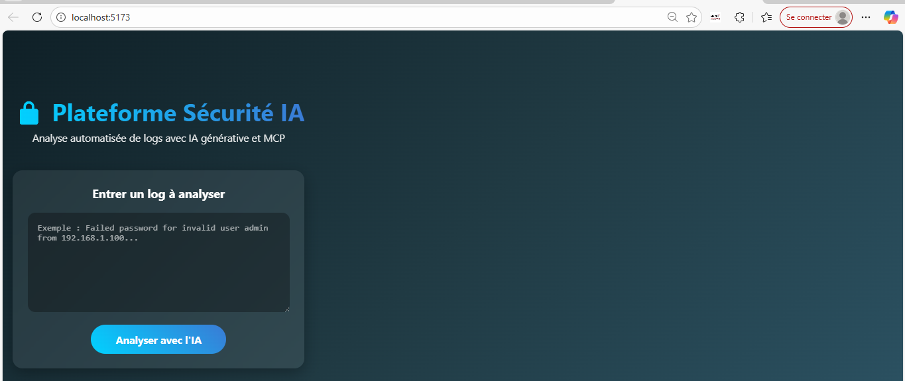

# Plateforme Sécurité IA - PFE 2025-2026

**Plateforme hybride cloud-réseaux sécurisée avec IA générative et multi-agents MCP pour l'analyse automatisée de logs**

## Fonctionnalités
- Analyse de logs en temps réel avec IA locale (Ollama + phi3:mini)
- Multi-agents collaboratifs (CrewAI) : Analyste, Remédiateur, Validateur
- Interface web moderne (React + Vite)
- Détection d'anomalies, actions techniques et criticité
- Traçabilité blockchain Hyperledger Fabric des décisions critiques (en cours d'intégration finale)

## Lancement rapide
1. Activer le venv : `venv\Scripts\activate`
2. Lancer le backend : `python backend\app.py`
3. Lancer le frontend : `cd frontend && npm run dev`
4. Ouvrir http://localhost:5173

## Auteur
Firas Kerkeni - PFE 2025-2026

## Captures d'écran

